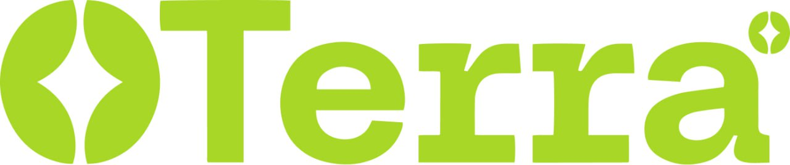

<div align="center">
  
</div>

<div align="center">
  <a href="https://terra-sandy.vercel.app/"><strong>Live demo</strong></a>
  
</div>

# Terra

Terra is a marketplace that connects coffee growers, buyers, and consumers by tokenizing specialty coffee microlots. Growers list their harvest as fractional lots; verified buyers acquire and manage inventory directly; consumers discover coffee, collect digital rewards, and explore verifiable origin stories.

## Business Overview

Terra brings transparency and access to the specialty coffee supply chain:

- Growers turn microlots into fractional digital assets (ERC-1155) with rich metadata and images, listing them directly to the market.
- Verified buyers purchase fractions aligned with their needs, enabling flexible sourcing and inventory planning.
- Consumers engage with coffee stories, locations, and rewards, reinforcing loyalty and origin traceability.

### Key Features by Persona

#### For Growers

- **Tokenize microlots**: Create fractional lots with total supply and price per token.
- **Rich lot profiles**: Add variety, altitude, harvest date, processing method, descriptions, and images (stored via IPFS/Pinata).
- **Manage inventory**: View and manage your listed microlots from the dashboard.
- **Direct-to-buyer sales**: Reach verified buyers without intermediaries; track recorded purchases.
- **On-chain ready**: ERC-1155 contract supports distribution of tokens to contributors on sale closure (Lisk L2).

#### For Buyers

- **Business verification**: Set up a verified buyer profile (supports SSI-style data and credentials) to unlock purchasing.
- **Browse marketplace**: Discover available microlots with detailed metadata and links to token instances on a block explorer.
- **Fractional purchasing**: Choose exact quantities, record purchases, and track holdings in your dashboard.
- **Lisk L2 integration**: Built around ERC-1155 ownership and ready for on-chain settlement on Lisk Sepolia.

#### For Consumers

- **Discover and explore**: Consumer app with map and search to find coffee shops and their coffees.
- **Collect rewards**: POAP-style collectibles and a collections view to showcase tastings and visits.
- **Traceability storytelling**: Access lot details and provenance links that connect bean to cup.

## 📦 Monorepo Structure

This repository is a pnpm monorepo. It consists of the following main parts:

- `apps/web`: Next.js 15 application (UI, pages, API routes, auth, providers).
- `packages/ui`: Shared UI library (shadcn/ui-based) published as `@terra/ui`.
- `packages/s-contracts`: Hardhat project containing the ERC-1155 smart contract(s) for Lisk Sepolia.
- `packages/convex`: Convex backend code (schema, functions, tables, storage, auth adapter).
- `tooling/`: Shared configs for ESLint, Prettier, TypeScript, etc.

## 🧰 Tech Stack

- **Next.js 15 & Turbopack**
- **Auth**: NextAuth.js (Credentials flow from wallet auth via Dynamic)
- **Web3**: Wagmi + Viem, Lisk Sepolia network
- **Backend**: Convex (functions, tables, storage, auth integration)
- **i18n**: next-intl
- **UI**: shadcn/ui via `@terra/ui`, Tailwind v4
- **Forms/Validation**: react-hook-form + zod
- **IPFS**: Pinata (JWT), configurable gateway

## ✨ Core Features

- **Wallet sign-in** with Dynamic; session persisted via NextAuth (credentials provider).
- **Producers create microlots** with variety, altitude, processing, price, supply, image, and metadata URI.
- **Buyers purchase fractions**; holdings and purchases are recorded and visible in the dashboard.
- **Real-time updates** via Convex React client and storage-backed media.
- **On-chain contract** (ERC-1155) included for tokenization, with deployment scripts to Lisk Sepolia.

Note: The included smart contract (`TerraFactory`) supports fractional contributions and distribution. The current web app records purchases in Convex; on-chain settlement can be wired via Viem calls as a next step.

## 🚀 Getting Started

Follow these steps to run Terra locally.

### Prerequisites

- Node.js 20+ (see `.nvmrc`)
- pnpm (see `packageManager` in `package.json`)
- A Convex project (or use `convex dev` locally)
- A Dynamic Labs project (for wallet auth)
- A Pinata account (for IPFS uploads)

### 1) Install dependencies

```bash
pnpm install
```

### 2) Configure environment

Create a `.env` file at the monorepo root (the web app loads `../../.env`). Use this template and fill in your values:

```bash
# ---------- Public (client) ----------
NEXT_PUBLIC_CONVEX_URL="https://<your-convex>.convex.cloud"
NEXT_PUBLIC_DYNAMIC_ENVIRONMENT_ID="<dynamic_environment_id>"
NEXT_PUBLIC_GATEWAY_URL="https://gateway.pinata.cloud/ipfs/"

# ---------- Server (web) ----------
AUTH_SECRET="<nextauth_secret>"
CONVEX_AUTH_PRIVATE_KEY="<rsa_pkcs8_private_key_for_RS256>"
CONVEX_AUTH_ADAPTER_SECRET="<long_random_string>"
NEXT_DYNAMIC_BEARER_TOKEN="<dynamic_server_bearer_token>"
PINATA_JWT="<pinata_jwt>"

# ---------- Convex (CLI/hosting) ----------
CONVEX_DEPLOY_KEY="<optional_if_deploying>"
CONVEX_SITE_URL="https://<your-convex>.site"

# ---------- Optional (production) ----------
NEXTAUTH_URL="https://your-deployment.example"
PORT=3000
```

How to obtain values:

- **Convex**: Run `pnpm -F @terra/convex dev` to bootstrap a dev instance and copy the printed URL for `NEXT_PUBLIC_CONVEX_URL`. In hosted projects, get URLs and deploy keys from the Convex dashboard.
- **Dynamic**: Create a project, then copy the Environment ID (client) and a bearer token (server) for `NEXT_DYNAMIC_BEARER_TOKEN`.
- **Auth secrets**: Generate with `openssl rand -base64 32` (or use NextAuth tool) for `AUTH_SECRET` and `CONVEX_AUTH_ADAPTER_SECRET`.
- **Pinata**: Create a JWT in Pinata settings.
- **RSA key**: `CONVEX_AUTH_PRIVATE_KEY` should be an RSA PKCS#8 private key string used to mint Convex identities in the session callback.

### 3) Start the app

From the monorepo root:

```bash
pnpm dev
```

The web app will be available at `http://localhost:3000`.

If you prefer running services individually:

```bash
# Start Convex dev (prints a dev URL)
pnpm -F @terra/convex dev

# In another terminal, start the web app
pnpm -F web dev
```

## 🧪 Smart Contracts (Lisk Sepolia)

Contracts live in `packages/s-contracts`.

- Main contract: `contracts/Terra.sol` (ERC-1155 fractionalization via `TerraFactory`)
- Networks: `liskSepolia` configured; Hardhat also includes Sepolia as example

Common commands:

```bash
# From repo root or package dir
pnpm -F s-contracts build
pnpm -F s-contracts compile

# Show signer (requires DEPLOYER_PRIVATE_KEY in .env)
pnpm -F s-contracts node scripts/show-signer.ts

# Deploy via Ignition/script (ensure RPC + key are set)
pnpm -F s-contracts node scripts/deployOptions.mjs
```

Required env for contracts:

```bash
DEPLOYER_PRIVATE_KEY="<hex_private_key>"   # with or without 0x prefix
```

Hardhat uses the public Lisk Sepolia RPC `https://rpc.sepolia-api.lisk.com` by default.

## 🗄️ Convex Backend

- Schema: `packages/convex/convex/schema.ts`
- Key tables: `users`, `microlots`, `microlotPurchases`, `tokenHoldings`, `producers`, `coffeeShops`, `buyerVerifications`
- Auth adapter: `packages/convex/convex/authAdapter.ts` and `auth.config.ts`
- Selected functions:
  - `users.createUserIfNotExists`, `users.getUserIdByEmail`
  - `microlots.createMicrolot`, `microlots.listMicrolotsPaginated`, `microlots.buyTokens`

Run locally:

```bash
pnpm -F @terra/convex dev
```

## 🔑 Authentication Flow

- Wallet connection and auth handled by Dynamic (`apps/web/app/(app)/_providers/dynamic-wrapper.tsx`).
- On successful wallet auth, a credentials token is posted to NextAuth.
- Session callback (see `apps/web/auth.ts`) ensures the user exists in Convex and attaches the Convex subject to the session.

## 📊 App Highlights

- Responsive dashboard and UI components from `@terra/ui`.
- Charts and tables for marketplace and ownership views.
- i18n-ready routing under `apps/web/app/(app)/[locale]/*`.

## 📜 Scripts

Root scripts:

```bash
pnpm dev           # Start monorepo dev (web, etc.)
pnpm build         # Build all
pnpm typecheck     # Type-check all
pnpm lint          # Lint all
pnpm format        # Prettier check
```

Web app scripts (`apps/web`):

```bash
pnpm -F web dev        # Next.js dev with Turbopack
pnpm -F web build
pnpm -F web start
```

Convex scripts (`packages/convex`):

```bash
pnpm -F @terra/convex dev
pnpm -F @terra/convex setup
```

Smart contracts (`packages/s-contracts`): see Smart Contracts section above.

## ✅ Development Tips

- Ensure `.env` is at the repo root (the web app reads `../../.env`).
- If auth fails locally, verify `AUTH_SECRET`, `CONVEX_AUTH_PRIVATE_KEY`, and `CONVEX_AUTH_ADAPTER_SECRET` are set and consistent.
- After starting Convex dev, update `NEXT_PUBLIC_CONVEX_URL` with the printed URL.
- For Lisk Sepolia, add the network to your wallet if not present.

## 📄 License

Apache License 2.0

## 🙋 Project Links

- Live demo: https://terra-sandy.vercel.app/
- Pitch deck: [Canva](https://www.canva.com/design/DAGxm5HvLb4/Y3tf4OPFqlqLL3sfH5PtWQ/edit?utm_content=DAGxm5HvLb4&utm_campaign=designshare&utm_medium=link2&utm_source=sharebutton)
- Brand kit: [Figma](https://www.figma.com/design/G2DstynBBYvWRrvI2U953o/Untitled?node-id=0-1&t=tMrbHIlUTSPaZv5D-1)
